# Vibe Coding

**Vibe coding** is a development style where you describe what you want in natural language and let AI coding assistants (Claude Code, Cursor, GitHub Copilot, etc.) generate the implementation. This guide helps scientists and researchers adopt vibe coding effectively—shipping working code faster while maintaining quality and understanding.

```mermaid
%%{init: {'theme': 'base', 'flowchart': { 'nodeSpacing': 20, 'rankSpacing': 40 }}}%%
flowchart LR
    subgraph Human["👤 Human"]
        subgraph H1[ ]
            T[🧪 Test]
        end
        subgraph H2[ ]
            PR[✅ Proof]
        end
    end

    subgraph AI["🤖 LLM"]
    end

    subgraph Soft["💻 Software"]
        subgraph S1[ ]
            C[Code & Interpreter]
        end
        subgraph S2[ ]
            GH[GitHub]
        end
    end

    T --> AI
    AI <--> C
    GH <--> AI
    AI --> PR
    PR -.->|🔄| T

    style Human fill:#e8f4f8,stroke:#5ba3c0,stroke-width:2px,color:#2c5f7c
    style AI fill:#4a5568,stroke:#2d3748,stroke-width:2px,color:#fff
    style Soft fill:#f0fff4,stroke:#68d391,stroke-width:2px,color:#276749
    style H1 fill:none,stroke:none
    style H2 fill:none,stroke:none
    style S1 fill:none,stroke:none
    style S2 fill:none,stroke:none
    
    style T fill:#fff,stroke:#5ba3c0,color:#2c5f7c
    style PR fill:#fff,stroke:#5ba3c0,color:#2c5f7c
    style C fill:#fff,stroke:#68d391,color:#276749
    style GH fill:#fff,stroke:#68d391,color:#276749
    
    linkStyle 0,1,2,3 stroke:#4a5568,stroke-width:2px
    linkStyle 4 stroke:#e53e3e,stroke-width:2px
```

**The Loop**: You supply *test cases* → LLM produces *verification* → Iterate until satisfied. The point is, never touch code, if the code is not satisfactory, provide your intuition with more tests!

---

## High-Level Wisdom

Before diving into the workflow, some foundational knowledge remains essential. Paradoxically, **conceptual understanding becomes more important** in the era of vibe coding—you need to recognize good solutions, catch AI mistakes, and guide the AI toward optimal approaches.

### Math & Domain Knowledge
- Domain-specific and outside the scope of this guide, but essential for validating AI output in your field.

### Algorithmic Thinking
- **Paradigms**: greedy, divide-and-conquer, dynamic programming, backtracking, branch-and-bound
- **Optimization techniques**: linear/integer programming, convex optimization, heuristics (genetic algorithms, simulated annealing)
- Know when to suggest an approach to the AI vs. letting it choose.

### Computational Theory
- **Complexity**: time/space complexity, Big-O notation, amortized analysis
- **Hardness classes**: P, NP, NP-complete, NP-hard—know when a problem is fundamentally hard
- **Foundational concepts**: expression trees, automata, Turing completeness

### Modern Software Engineering
- **Tooling**: version control (git), code review, CI/CD pipelines, containerization
- **Methodologies**: agile, iterative development, test-driven development
- **Architecture**: modularity, separation of concerns, API design

> ⚠️ Unlike HPC concepts (MPI, OpenMP, CUDA) that AI readily suggests when needed, this high-level wisdom represents a **mindset** that doesn't emerge naturally from vibe coding alone. Invest in learning these fundamentals separately.

---

## Step 0: Set the Context

Before writing any code, prime your AI assistant with the right context.

### Project Setup Files
Create persistent context files that the AI reads automatically:
- `CLAUDE.md` (for Claude Code) or `CURSOR_RULES.md` (for Cursor)
- Include: tech stack, coding conventions, architectural decisions, common pitfalls

### Initial Prompt Checklist
When starting a new project or feature, communicate:
- [ ] **Goal**: What are you building? What problem does it solve?
- [ ] **Constraints**: Performance requirements, compatibility needs, dependencies to avoid
- [ ] **Tech stack**: Language, frameworks, existing codebase patterns
- [ ] **Scale**: Expected data sizes, user load, deployment environment
- [ ] **Non-goals**: What you explicitly don't want (prevents over-engineering)

### Context Window Management
AI assistants have limited memory. For large codebases:
- Use tools like `@codebase` mentions or file references strategically
- Summarize previous conversation context when starting fresh
- Break large tasks into focused subtasks with clear handoffs

---

## Step 1: Make a Plan

Planning can be done interactively with your AI assistant. Ask it to outline the approach before diving into implementation.

### Scaffolding Suggestions
Let the AI handle boilerplate and setup:
- **Environment**: Use modern tools (`uv` for Python, `cargo` for Rust, etc.)
- **Build automation**: Create a `Makefile` or `justfile` for common tasks
- **CI/CD**: Set up GitHub Actions, GitLab CI, or similar
- **Branch protection**: Use `gh` CLI to configure PR requirements and protect `main`
- **Documentation**: Generate initial docs structure (README, API docs, contributing guide)

### Architecture Review
Before implementation, ask the AI to:
- Explain the proposed architecture
- Identify potential bottlenecks or edge cases
- Suggest alternatives with trade-offs

---

## Step 2: Test → Verify → Iterate

**Don't read code line-by-line.** Instead, verify through tests:

1. **Write a test** that captures your expectation
2. **Let AI run it** and analyze the result
3. **Review the proof** — did it pass? Does the explanation make sense?
4. **If not satisfied** — write another test that expresses your intuition more precisely
5. **Repeat** until all your tests pass and you trust the result

> The key insight: Express your knowledge through tests, not by editing code. Your domain expertise becomes test cases.

---

## Step 3: Document & Release

Let AI handle the busywork:

1. **Document** — Ask AI to generate README, API docs, and architecture diagrams. You are the first user of your package, provide use cases, let AI to include them in the documentation, iterate until you are satisfied.
2. **Version** — Bump version ([semver](https://semver.org/)), update changelog
3. **Publish** — Register on PyPI, crates.io, npm, etc.
4. **Tag** — Create GitHub Release with notes

> For teams: You own what you commit. Note AI-generated parts in PRs and agree on verification standards.