# Vibe Coding

**Vibe coding** is a development style where you describe what you want in natural language and let AI coding assistants (Claude Code, Cursor, GitHub Copilot, etc.) generate the implementation. This guide helps scientists and researchers adopt vibe coding effectively—shipping working code faster while maintaining quality and understanding.

```mermaid
flowchart TB
    subgraph Human["👤 Human"]
        T[🧪 Test]
        PR[✅ Proof]
    end

    subgraph AI["🤖 LLM"]
    end

    subgraph Soft["💻 Software"]
        C[Code & Interpreter]
        GH[GitHub]
    end

    T --> AI
    AI <--> C
    GH <--> AI
    AI --> PR
    PR -.->|🔄| T

    style Human fill:#e8f4f8,stroke:#5ba3c0,stroke-width:2px,color:#2c5f7c
    style AI fill:#4a5568,stroke:#2d3748,stroke-width:2px,color:#fff
    style Soft fill:#f0fff4,stroke:#68d391,stroke-width:2px,color:#276749
    
    style T fill:#fff,stroke:#5ba3c0,color:#2c5f7c
    style PR fill:#fff,stroke:#5ba3c0,color:#2c5f7c
    style C fill:#fff,stroke:#68d391,color:#276749
    style GH fill:#fff,stroke:#68d391,color:#276749
    
    linkStyle 0,1,2,3 stroke:#4a5568,stroke-width:2px
    linkStyle 4 stroke:#e53e3e,stroke-width:2px
```

**The Loop**: You provide *context* and *high-level wisdom* → LLM generates *code* → You supply *test cases* → LLM produces *verification* → Iterate until satisfied.

---

## High-Level Wisdom

Before diving into the workflow, some foundational knowledge remains essential. Paradoxically, **conceptual understanding becomes more important** in the era of vibe coding—you need to recognize good solutions, catch AI mistakes, and guide the AI toward optimal approaches.

### Math & Domain Knowledge
- Domain-specific and outside the scope of this guide, but essential for validating AI output in your field.

### Algorithmic Thinking
- **Paradigms**: greedy, divide-and-conquer, dynamic programming, backtracking, branch-and-bound
- **Optimization techniques**: linear/integer programming, convex optimization, heuristics (genetic algorithms, simulated annealing)
- Know when to suggest an approach to the AI vs. letting it choose.

### Computational Theory
- **Complexity**: time/space complexity, Big-O notation, amortized analysis
- **Hardness classes**: P, NP, NP-complete, NP-hard—know when a problem is fundamentally hard
- **Foundational concepts**: expression trees, automata, Turing completeness

### Modern Software Engineering
- **Tooling**: version control (git), code review, CI/CD pipelines, containerization
- **Methodologies**: agile, iterative development, test-driven development
- **Architecture**: modularity, separation of concerns, API design

> ⚠️ Unlike HPC concepts (MPI, OpenMP, CUDA) that AI readily suggests when needed, this high-level wisdom represents a **mindset** that doesn't emerge naturally from vibe coding alone. Invest in learning these fundamentals separately.

---

## Step 0: Set the Context

Before writing any code, prime your AI assistant with the right context.

### Project Setup Files
Create persistent context files that the AI reads automatically:
- `CLAUDE.md` (for Claude Code) or `CURSOR_RULES.md` (for Cursor)
- Include: tech stack, coding conventions, architectural decisions, common pitfalls

### Initial Prompt Checklist
When starting a new project or feature, communicate:
- [ ] **Goal**: What are you building? What problem does it solve?
- [ ] **Constraints**: Performance requirements, compatibility needs, dependencies to avoid
- [ ] **Tech stack**: Language, frameworks, existing codebase patterns
- [ ] **Scale**: Expected data sizes, user load, deployment environment
- [ ] **Non-goals**: What you explicitly don't want (prevents over-engineering)

### Context Window Management
AI assistants have limited memory. For large codebases:
- Use tools like `@codebase` mentions or file references strategically
- Summarize previous conversation context when starting fresh
- Break large tasks into focused subtasks with clear handoffs

---

## Step 1: Make a Plan

Planning can be done interactively with your AI assistant. Ask it to outline the approach before diving into implementation.

### Scaffolding Suggestions
Let the AI handle boilerplate and setup:
- **Environment**: Use modern tools (`uv` for Python, `cargo` for Rust, etc.)
- **Build automation**: Create a `Makefile` or `justfile` for common tasks
- **CI/CD**: Set up GitHub Actions, GitLab CI, or similar
- **Branch protection**: Use `gh` CLI to configure PR requirements and protect `main`
- **Documentation**: Generate initial docs structure (README, API docs, contributing guide)

### Architecture Review
Before implementation, ask the AI to:
- Explain the proposed architecture
- Identify potential bottlenecks or edge cases
- Suggest alternatives with trade-offs

---

## Step 2: Verify the Work

Should you check AI-generated code line by line? **Not necessarily.** But blind trust is dangerous. Use systematic verification:

### Testing
- Improve test coverage—design tests for edge cases the AI might miss
- Include property-based tests for algorithmic code
- Test failure modes, not just happy paths

### Performance
- Generate profiling reports and establish benchmarks
- Compare against baseline or known implementations
- Watch for accidentally quadratic algorithms

### Security (if applicable)
- Run dependency audits (`npm audit`, `cargo audit`, `pip-audit`)
- Check for hardcoded secrets or insecure defaults
- Review authentication/authorization logic manually

### Documentation
- Document algorithm design and key implementation decisions
- Ensure the AI explains *why*, not just *what*
- Generate architecture diagrams for complex systems

---

## Step 3: Debug Iteratively

Things will break. Here's how to debug effectively with AI:

### Sharing Errors
- Paste the **full error message** and stack trace
- Include relevant code context (the AI may have forgotten)
- Describe what you expected vs. what happened

### Iteration Strategies
- **Small steps**: Fix one issue at a time
- **Checkpoints**: Save working states before major changes
- **Fresh start**: If context is polluted, summarize the problem and start a new conversation

### Know When to Intervene
Sometimes it's faster to fix it yourself:
- Simple typos or off-by-one errors
- When the AI keeps suggesting the same broken approach
- Domain-specific bugs requiring specialized knowledge

---

## Step 4: Release

### Version Management
- Bump version numbers following [semver](https://semver.org/)
- Update changelog with meaningful descriptions

### Package Registration
- Publish to appropriate registry: PyPI, crates.io, npm, JuliaRegistrator, etc.
- Ensure metadata (description, keywords, license) is complete

### Git Hygiene
- Tag the release on GitHub
- Create a GitHub Release with notes
- Consider automated release workflows

---

## Team Collaboration

When working with others on AI-assisted code:

- **PR descriptions**: Note which parts were AI-generated and what you verified
- **Code ownership**: You're responsible for AI code you commit—review it as if a junior wrote it
- **Knowledge sharing**: Document insights from AI interactions that benefit the team
- **Consistency**: Agree on AI tool usage and verification standards as a team