# Vibe Coding

**Vibe coding** is a development style where you describe what you want in natural language and let AI coding assistants (Claude Code, Cursor, GitHub Copilot, etc.) generate the implementation. This guide helps scientists and researchers write correct code without reading it line-by-line.

```mermaid
%%{init: {'theme': 'base', 'flowchart': { 'nodeSpacing': 20, 'rankSpacing': 40 }}}%%
flowchart LR
    subgraph Human["👤 Human"]
        subgraph H1[ ]
            T[🧪 Test]
        end
        subgraph H2[ ]
            PR[✅ Proof]
        end
    end

    subgraph AI["🤖 LLM"]
    end

    subgraph Soft["💻 Software"]
        subgraph S1[ ]
            C[Code & Interpreter]
        end
        subgraph S2[ ]
            GH[GitHub]
        end
    end

    T --> AI
    AI <--> C
    GH <--> AI
    AI --> PR
    PR -.->|🔄| T

    style Human fill:#e8f4f8,stroke:#5ba3c0,stroke-width:2px,color:#2c5f7c
    style AI fill:#4a5568,stroke:#2d3748,stroke-width:2px,color:#fff
    style Soft fill:#f0fff4,stroke:#68d391,stroke-width:2px,color:#276749
    style H1 fill:none,stroke:none
    style H2 fill:none,stroke:none
    style S1 fill:none,stroke:none
    style S2 fill:none,stroke:none
    
    style T fill:#fff,stroke:#5ba3c0,color:#2c5f7c
    style PR fill:#fff,stroke:#5ba3c0,color:#2c5f7c
    style C fill:#fff,stroke:#68d391,color:#276749
    style GH fill:#fff,stroke:#68d391,color:#276749
    
    linkStyle 0,1,2,3 stroke:#4a5568,stroke-width:2px
    linkStyle 4 stroke:#e53e3e,stroke-width:2px
```

**The Loop**: Test → LLM verifies → Review proof → Repeat. Never touch code—if unhappy, add more tests!

---

## Step 0: Set the Context

Give your AI the context it needs before starting.

### Project Setup Files
Create persistent context files that the AI reads automatically:
- `CLAUDE.md` (for Claude Code) or `CURSOR_RULES.md` (for Cursor)
- Include: tech stack, coding conventions, architectural decisions, common pitfalls

### Initial Prompt Checklist
When starting a new project or feature, communicate:
- [ ] **Goal**: What are you building? What problem does it solve?
- [ ] **Constraints**: Performance requirements, compatibility needs, dependencies to avoid
- [ ] **Tech stack**: Language, frameworks, existing codebase patterns
- [ ] **Scale**: Expected data sizes, user load, deployment environment
- [ ] **Non-goals**: What you explicitly don't want (prevents over-engineering)

### Context Window Management
AI assistants have limited memory. For large codebases:
- Use tools like `@codebase` mentions or file references strategically
- Summarize previous conversation context when starting fresh
- Break large tasks into focused subtasks with clear handoffs

---

## Step 1: Make a Plan

Plan interactively with AI. Ask it to outline the approach before coding.

### Scaffolding Suggestions
Let the AI handle boilerplate and setup:
- **Environment**: Use modern tools (`uv` for Python, `cargo` for Rust, etc.)
- **Build automation**: Create a `Makefile` or `justfile` for common tasks
- **CI/CD**: Set up GitHub Actions, GitLab CI, or similar
- **Branch protection**: Use `gh` CLI to configure PR requirements and protect `main`
- **Documentation**: Generate initial docs structure (README, API docs, contributing guide)

### Architecture Review
Before implementation, ask the AI to:
- Explain the proposed architecture
- Identify potential bottlenecks or edge cases
- Suggest alternatives with trade-offs

---

## Step 2: Test → Verify → Iterate

**Don't read code line-by-line.** Instead, verify through tests:

1. **Write a test** that captures your expectation
2. **Let AI run it** and analyze the result
3. **Review the proof** — did it pass? Does the explanation make sense?
4. **If not satisfied** — write another test that expresses your intuition more precisely
5. **Repeat** until all your tests pass and you trust the result

> Express your knowledge through tests, not by editing code. Your domain expertise becomes test cases.

---

## Step 3: Document & Release

Let AI do the tedious parts:

1. **Document** — Ask AI to generate README, API docs, and architecture diagrams. You are the first user of your package, provide use cases, let AI to include them in the documentation, iterate until you are satisfied.
2. **Version** — Bump version ([semver](https://semver.org/)), update changelog
3. **Publish** — Register on PyPI, crates.io, npm, etc. (these all can be automated!)
4. **Tag** — Create GitHub Release with notes

---

## Going Deeper: Why Fundamentals Still Matter

You still need fundamentals. Paradoxically, **conceptual understanding becomes more important** when you stop writing code—you need to recognize good solutions, catch AI mistakes, and guide AI toward better approaches.

- **Math & Domain Knowledge** — Essential for validating AI output in your field
- **Algorithmic Thinking** — Paradigms (greedy, DP, divide-and-conquer), optimization techniques, knowing when to guide AI
- **Computational Theory** — Complexity (Big-O), hardness classes (P, NP), foundational concepts
- **Software Engineering** — Version control, CI/CD, testing, modularity, API design

> ⚠️ Unlike HPC concepts (MPI, OpenMP, CUDA) that AI readily suggests, these fundamentals represent a **mindset** that doesn't emerge from vibe coding alone. Learn them separately.